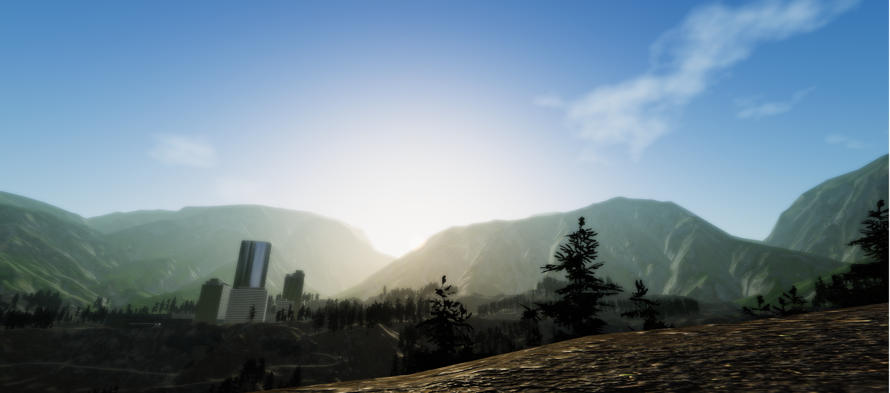
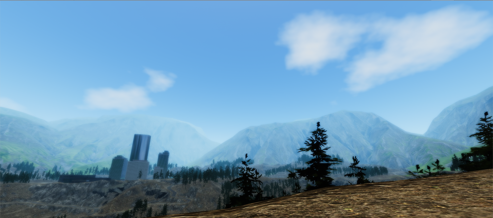
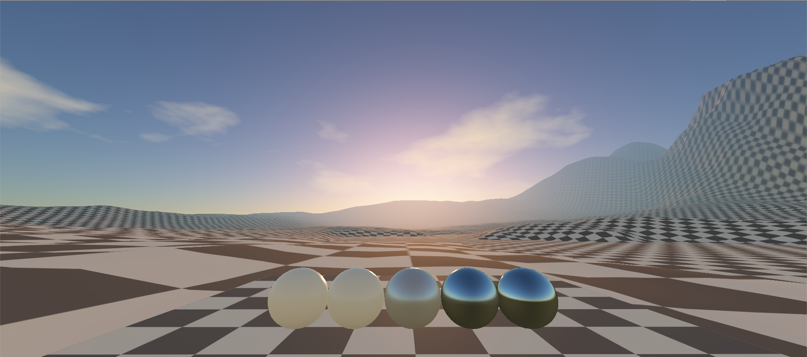
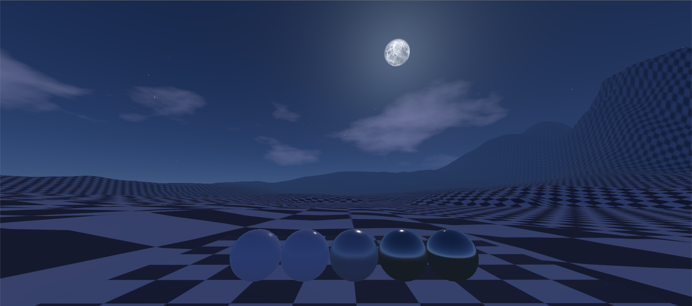

# LSky Dynamic Skydome for Unity Engine.
-------------

# Pics
-------------

--------------
> I am using this asset for prototypes. this repo is archived LSky v4.0 comming soon.
--------------

#Donate?
--------------
If someone wants to help the asset stay alive, you can do it through patreon, later share other assets that I am using in my projects : https://www.patreon.com/user/overview?u=19985678
--------------

Status:
-------------

>- Status: 3.2.1 Archived.
>- Support: Built in Render/Monobehaviour.
-------------

Known Issues
-------------
>- 
-------------

Features:
--------------

Outer Space:
--------------
- Deep space based on cubemaps.
- Stars field based on cubemaps.
- Moon phases.
- Realistic sun and moon coordinates(WIP)
--------------
Atmosphere:
--------------
- Atmospheric scattering based on Preetham and Hoffman papers.
- Night support.
- Semi Artistic control.
- Fog tinted with sky color.
--------------
Clouds:
--------------
- Simple clouds.
--------------
Color:
--------------
- HDR/LDR support.
- Gamma/Linear support.
- Forward/Deferred support.
--------------
Date Time:
--------------
- Gregorian calendar support.
- DateTime manager based on timeline.
- System synchronization.
- Delegate events.
- Unity events.
--------------
Skydome:
--------------
- Exclude/Render layers support.
--------------
Utility:
--------------
- Editor: Separator.
- Editor: Curve range field property drawer.
- Reflection probes refresh scripts.
- Editor: Foldout header
--------------
